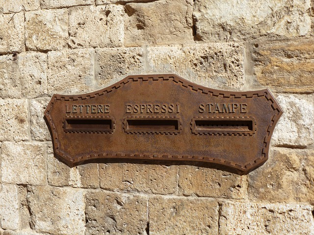

  

    

      
      

    

    

      <h3><a href="members.html">Lab members</a></h3>
      
Meet the members of our lab <a href="members.html">here</a>

    

  

  

  

    

      <h3><a href="events.html">Events</a></h3>
      
Find some of the events where you can <a href="events.html">meet us</a>

    

    

      
      

    

  

  

  
  

    

      
      

    

    

      <h3><a href="members.html">Collaborations</a></h3>
      
Meet the members of our lab <a href="collaborations.html">here</a>

    

  

  

  

    

      <h3><a href="open_positions.html">Open positions</a></h3>
      
<a href="open_positions.html">Join</a> our team

    

    

      
      

    

  

  

  

    

      
      

    

    

      <h3><a href="contact.html">Contact us</a></h3>
      
Find out where we are and how to <a href="contact.html">contact us</a>

    

  

  

  

    

      <h3><a href="more_information.html">More information</a></h3>
      
<a href="more_information.html">Find us</a> on other services

    

    

      
      

    

  

  

