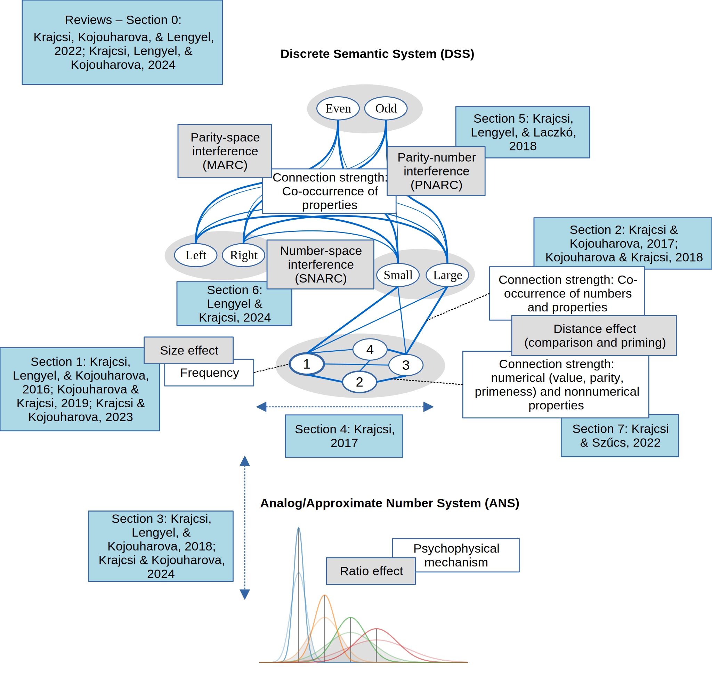

## The widely accepted explanation for number processing

Symbolic and non-symbolic numbers are thought to be processed by an evolutionarily ancient, simple representation, working according to Weber's law. This **Analogue Number System (ANS)** is thought to be the very base of number understanding: its precision influences mathematical abilities, its loss impairs many aspects of number processing, and its functioning can be seen in number comparison, estimation, approximations, and so on. Hundreds of academic works support its existence and describe its properties.

But there are some fundamental problems with this explanation. For example, how can we be sure that any distance effect (improving performance of a numerical task as the difference increases) is the sign of the ANS when representations with completely different architectures can also produce a distance effect, e.g., when naming pictures of objects? Or how can an imprecise system exclusively direct the performance of an exact task, like the performance of precise symbolic number comparison, while the sign of any other mechanism, which is undeniably necessary for solving the precise task, is practically invisible?

## An alternative solution

Because of these problems, we started to think about alternative representations that could explain known symbolic numerical phenomena and representations that are precise in nature. Quite intuitively, one can imagine that numbers are abstract units of thought, and they might be stored similarly to words or concepts. A representation, we term the **Discrete Semantic System (DSS)**, similar to a conceptual network or to the mental lexicon, can account for symbolic numerical effects. (Note that the DSS is an alternative only for the symbolic number processing, but not for the non-symbolic processing. We still propose that non-symbolic numbers are processed by the ANS.) For example, the distance effect might rely on the gradual semantic relations of the number units in the network. Or the size effect (smaller numbers are easier to process in a comparison task) can be the result of the frequency of numbers: because lower numbers are more frequent, they can be processed more easily. Interference of some properties (e.g., space and numbers) can be the result of interference of concepts (e.g., between large-small and left-right nodes), as seen in many other conceptual interferences. This alternative explanation seemed to be surprisingly efficient at explaining all of the known symbolic numerical effects that are attributed to the classic ANS model.

## Contrasting the two models

In most cases, the classic ANS model and our alternative DSS model explain the same phenomena seemingly equally well, and it is not easy to find phenomena that could decide which explanation works better. So in several works, we started to contrast the two models, introducing new paradigms and analysis methods or critically reanalyzing already known phenomena.

Here is a short summary of what we found so far.

### 0. Symbolic comparison effects are different than nonsymbolic comparison effects

<i class='fa fa-file'></i> Krajcsi, A., Kojouharova, P., & Lengyel, G. The hybrid ANS-DSS account in a nutshell. See our summary presentation [here](https://docs.google.com/presentation/d/1pkvvC9Vd87OtdXvLnCdrsOMOH203IvhEvsuiYATrGFY/edit?usp=sharing).

---

In a brief review, through the example of comparison distance and size effects, we summarize the main reasons why the ANS has been a reasonable explanation in the last decades, why an alternative DSS account is justifiable, and what our works (as of 2020), contrasting the two accounts, reveal about the nature of symbolic and nonsymbolic comparison tasks. We found that, unlike the prediction of the pure ANS account, (a) the critical properties of the symbolic comparison and the nonsymbolic comparison differ, and (b) while the properties of the distance and the size effects are similar within a nonsymbolic comparison task, the properties of the two effects are different within a symbolic comparison task.

<i class='fa fa-file-text'></i> 
Krajcsi, A., Kojouharova, P., & Lengyel, G. (2022). Processing Symbolic Numbers: The Example of Distance and Size Effects. In J. Gervain, G. Csibra, & K. Kovács (Eds.), A Life in Cognition: Studies in Cognitive Science in Honor of Csaba Pléh (pp. 379–394). Springer International Publishing. [https://doi.org/10.1007/978-3-030-66175-5_27](https://doi.org/10.1007/978-3-030-66175-5_27) Or read the [preprint version](https://psyarxiv.com/5wzcx).

### 1. The symbolic numerical size effect is a frequency effect
In the ANS model, the size effect in a comparison task is thought to be the consequence of the ratios of the values (Weber's law). In our alternative DSS model, it might be a frequency effect resulting from the uneven frequencies of numbers in everyday life. It is not trivial to test this assumption in Indo-Arabic numbers because they have been seen so many times that their perceived frequency is not easy to change. To get around this problem, in a new paradigm, new artificial numbers were learned, and the frequencies of the numbers were manipulated. We found that the size effect in a comparison task with these symbols follows the frequency of the numbers, as predicted by the DSS model.

<i class='fa fa-file-text'></i> Krajcsi, A., Lengyel, G., & Kojouharova, P. (2016). The Source of the Symbolic Numerical Distance and Size Effects. Frontiers in Psychology, 7. [https://doi.org/10.3389/fpsyg.2016.01795](https://doi.org/10.3389/fpsyg.2016.01795) or [read the preprint version](http://www.preprints.org/manuscript/201609.0025/v1)

---

In a follow-up work, we investigated whether the size effect can be changed in Indo-Arabic notation with the manipulation of the frequencies of those digits in a single session. We found that the size effect partly but significantly changes with the frequency of the digits. Also, there is a stable part of the size effect that is not modified by the session frequencies.

<i class='fa fa-file-text'></i> Kojouharova, P., & Krajcsi, A. (2019). Two components of the Indo-Arabic numerical size effect. Acta Psychologica, 192, 163–171. [https://doi.org/10.1016/j.actpsy.2018.11.009](https://doi.org/10.1016/j.actpsy.2018.11.009)

<i class='fa fa-table'></i> Find the raw data of this study at [osf.io](https://osf.io/2hrms/).

<i class='fa fa-file'></i> See a [poster presentation](http://www.cecog.eu/pastConf_pic/2017/posters/Petia_The%20numerical%20size%20effect%20in%20symbolic%20numbers%20and%20everyday%20number%20frequency%2020170522.pdf) about this work.

---

In a next study, we investigated whether (a) the frequency alone can account for the partial change of size effect seen in Arabic numbers (because the previous and current experience of stimulus statistics is integrated) or (b) the ANS may have a partial role that develops with time; therefore, it cannot be observed in new symbols, but it may exist in Arabic numbers. Participants learned new symbols, and, in a comparison task, the stimulus frequencies were manipulated. Importantly, the stimulus frequencies were changed in the middle of the session so that the integration of previous and current perceived stimulus statistics could be investigated. We found that the integration of stimulus frequency information alone can account for previously described phenomena, and no sign of ANS activation was observed. This is again in line with the pure DSS account of symbolic number processing.

<i class='fa fa-file-text'></i> Krajcsi, A., & Kojouharova, P. (2023). Stimulus frequency alone can account for the size effect in number comparison. Acta Psychologica, 232, 103817. [https://doi.org/10.1016/j.actpsy.2022.103817](https://doi.org/10.1016/j.actpsy.2022.103817)

<i class='fa fa-table'></i> Find the raw data and some of the calculations of this study at [osf.io](https://osf.io/auhwg/).

<i class='fa fa-file'></i> See a [presentation](https://docs.google.com/presentation/d/1szrjgqDrMSsrdZrAeDRLK_3D7YQvguEUa9aZ5_KPdq0/edit?usp=sharing) about this work.

### 2. The symbolic numerical distance effect is an association effect

In the classic ANS model, the distance effect of a comparison task is the consequence of the ratios of the numbers (Weber's law). In the DSS model, the distance effect might come from alternative sources; for example, it might be the consequence of some associations: larger numbers are relatively strongly associated with the concept 'large', while small numbers are relatively strongly associated with the concept 'small'. In this explanation, close numbers are hard to compare because they have similar associations with the 'large' or 'small' nodes. In an approach to contrast the two explanations, new symbols were taught, but some numbers were left out (i.e., only numbers between 1 and 3, and 7 and 9 were learned and practiced). It was found that around the 'gap', the distance effect showed a distance of 1, as predicted by the association explanation, and not by a distance of 4, as predicted by the values of those numbers, as supposed by the ANS model.

<i class='fa fa-file-text'></i> Krajcsi, A., & Kojouharova, P. (2017). Symbolic Numerical Distance Effect Does Not Reflect the Difference between Numbers. Frontiers in Psychology, 8. [https://doi.org/10.3389/fpsyg.2017.02013](https://doi.org/10.3389/fpsyg.2017.02013) or read the [preprint version](https://psyarxiv.com/bpy9c/).

---

The same question was also investigated with Indo-Arabic numbers, and we found that the Indo-Arabic distance effect is also modified immediately in a session by the association statistics of the numbers and larger-smaller categories.

<i class='fa fa-file-text'></i> Kojouharova, P., & Krajcsi, A. (2018). The Indo-Arabic distance effect originates in the response statistics of the task. Psychological Research. [https://doi.org/10.1007/s00426-018-1052-1](https://doi.org/10.1007/s00426-018-1052-1) or [read the paper online](https://rdcu.be/3iNv)

<i class='fa fa-table'></i> Find some of the analyses at [osf.io](https://osf.io/qjymb/).

### 3. Nonsymbolic comparison does not show the statistical effects of symbolic comparison.

We tested whether nonsymbolic number comparison is sensitive to the statistical features of the stimuli as seen in symbolic comparison. We found that, unlike in the symbolic comparison task, in the nonsymbolic comparison task, the distance effect was mainly influenced by the values rather than the statistics of the stimuli. Additionally, while the size effect was modified by the frequency of the stimuli, the change of the size effect may not have originated in the difficulty of the task (as predicted by the psychophysical models) but in other parameters of the decision process, such as the adjustment of the decision threshold. The results reflect that nonsymbolic number comparison is mainly driven by a psychophysical process; however, stimulus frequency has an additional role. Again, symbolic and nonsymbolic numerical stimuli are compared qualitatively differently.

<i class='fa fa-file-text'></i> Krajcsi, A., & Kojouharova, P. (2025). Different sources of the numerical comparison size effect. Memory & Cognition.

<i class='fa fa-table'></i> Find the raw data of this study at [osf.io](https://osf.io/5rzte/).

### 4. The ANS model describes non-symbolic comparison correctly, but it has systematic troubles with symbolic comparison
Previously, it has been demonstrated that the ANS model describes both symbolic and nonsymbolic comparisons correctly. In former studies, the goodness of fit was usually investigated. However, among others, our DSS model can predict a very similar performance pattern, which model would result in a similarly good goodness of fit. To overcome this limitation, we extensively analyzed non-symbolic dot comparison and symbolic Indo-Arabic comparison task performance, and beyond the goodness of fit, several other properties were investigated. We consistently found that while the ANS model can describe non-symbolic comparison relatively well, the ANS model gives a systematically biased and incorrect description of symbolic comparison.

<i class='fa fa-file-text'></i> Krajcsi, A., Lengyel, G., & Kojouharova, P. (2018). Symbolic number comparison is not processed by the analog number system: different symbolic and nonsymbolic numerical distance and size effects. Frontiers in Psychology, 9. [https://doi.org/10.3389/fpsyg.2018.00124](https://doi.org/10.3389/fpsyg.2018.00124) Or read the [preprint](https://psyarxiv.com/dmau5/).

<i class='fa fa-table'></i> Find the raw data of this study at [osf.io](https://osf.io/jw5ha/).

### 5. Numerical distance and size effects are independent in the symbolic comparison task
The classic ANS model proposes that distance and size effects are simply two ways to measure the single ratio effect (Weber's law). In the DSS model, distance and size effects rely on different mechanisms (the association between the numbers and small-large concepts, and the frequency of the numbers). Therefore, according to the ANS model, distance and size effects should correlate, while according to the DSS model, the two effects might be independent. It was found that while in non-symbolic comparison, the two effects perfectly correlate, in symbolic comparison, the two effects are largely independent.

<i class='fa fa-file-text'></i> Krajcsi, A. (2017). Numerical distance and size effects dissociate in Indo-Arabic number comparison. Psychonomic Bulletin & Review. 24(8), 927–934. [https://doi.org/10.3758/s13423-016-1175-6](https://doi.org/10.3758/s13423-016-1175-6). Or [read the final version online](http://rdcu.be/lqju) or [download the postprint](https://sites.google.com/site/mathematicalcognition/home/discrete-semantic-system/Distance%20and%20size%20effects%20correlation%20-%20postprint.pdf?attredirects=0&d=1).

<i class='fa fa-newspaper-o'></i> See a [blog post](http://www.psychonomic.org/news/news.asp?id=332300) about the work at Psychonomic Society.

### 6. Numbers interfere with discrete properties
The ANS model can explain several numerical interferences (e.g., the interference of the numbers with the location of the response button in a numerical task, termed the SNARC effect), suggesting that the analog (continuous) number representation interferes with other analog representations, e.g., the space in the case of the SNARC effect. We were looking for interference between a number and a discrete property, the parity, where the parity is most probably not stored on an analog representation. We found that numbers interfere with parity, questioning the current analog explanations.

<i class='fa fa-file-text'></i> Attila Krajcsi, Gábor Lengyel, Ákos Laczkó (2018). Interference between number magnitude and parity: Discrete representation in number processing. Experimental Psychology. 65(2), 71–83. [https://doi.org/10.1027/1618-3169/a000394](https://doi.org/10.1027/1618-3169/a000394)

<i class='fa fa-file'></i> In this work, we also introduced a new method to be able to discover heterogeneous interferences, i.e., where the direction of the interference effect is not uniform in the sample. Find more details about the dual index method [here](heterogeneous_interference.html).

<i class='fa fa-table'></i> Find the raw data of this study at [osf.io](https://osf.io/g7t2q/).

<i class='fa fa-file'></i> See a [presentation](https://osf.io/fst9v/) about this work.

### 7. The SNARC effect is present only with symbolic stimuli but not with nonsymbolic stimuli
The ANS model assumes that both symbolic and nonsymbolic number processing may interfere with spatial information when forming the SNARC effect. According to our hybrid ANS-DSS framework, the interference effect may be different for symbolic and nonsymbolic stimuli. We demonstrated that the SNARC effect is a symbolic-only effect; therefore, it cannot be accounted for by the ANS but can be explained by the DSS.

<i class='fa fa-file-text'></i> Lengyel, G., & Krajcsi, A. (2025). No observable spatial numerical associations of response codes effect with numbers in nonsymbolic format. Journal of Experimental Psychology: Human Perception and Performance. [https://doi.org/10.1037/xhp0001376](https://doi.org/10.1037/xhp0001376) Or read the [full text](https://www.researchgate.net/publication/396950588_No_observable_spatial_numerical_associations_of_response_codes_effect_with_numbers_in_nonsymbolic_format) on ResearchGate, the [preprint](https://osf.io/preprints/psyarxiv/2c9kr) or the [postprint](https://github.com/GaborLengyel/dot-SNARC/blob/main/DotSNARC_JEPH_accepted_v2.pdf) of the manuscript.

<i class='fa fa-table'></i> Find the experiment control script, the raw data, and the analysis script of this study at [GitHub](https://github.com/GaborLengyel/dot-SNARC).

### 8. The comparison distance effect and the priming distance effect rely on different mechanisms
The ANS model assumes that both the comparison distance effect (CDE) and the priming distance effect (PDE) are rooted in the same mechanism: they depend on the overlap of the two numbers' representation. This assumption implies that the CDE slope and the PDE slope correlate. We measured this correlation while making sure that the reliability of those slopes is appropriate so that low reliability cannot attenuate the correlation. No strong correlation was found, which questions the ANS account of the CDE and/or PDE.

<i class='fa fa-file-text'></i> Krajcsi, A., & Szűcs, T. (2022). Symbolic number comparison and number priming do not rely on the same mechanism. Psychonomic Bulletin & Review. [https://doi.org/10.3758/s13423-022-02108-x](https://doi.org/10.3758/s13423-022-02108-x)

<i class='fa fa-table'></i> Find the raw data of this study at [osf.io](https://osf.io/bs94q/).

<i class='fa fa-file'></i> See a [presentation](https://docs.google.com/presentation/d/1CbvNlfSTV6ATI5CKJMsOXghfKr3lqkoL61lrgTqQTD0/edit?usp=sharing) or a [poster](https://drive.google.com/uc?export=download&id=1lSj6IaWz3bpLxYCD2gyBSXwNIVohBMON) about this work.

### 9. Former findings supporting the DSS model
In the last decades of numerical cognition literature, there were several seemingly smaller findings that were not in line with the otherwise widely accepted ANS model. Usually, it is quite natural that there are occasional findings and details that are not consistent with a model, and because the ANS model seemed convincingly coherent, concise, and efficient, these issues didn’t seem too important. Looking from the viewpoint of the DSS model, these anomalies show some critical features of number processing, and they shed light on what alternative number representation should be proposed.

<i class='fa fa-file-text'></i> Check back for the preprint later.

---

More tests are on their way. Come back later to see some more works contrasting the ANS and DSS models.
