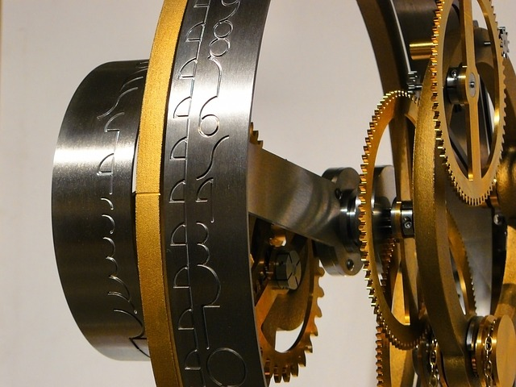

  

    

      
      

    

    

        <h3><a href="numerical_cognition.html">Numerical cognition works</a></h3>
        
One of our main interests is how people understand numbers and math. We conduct various experiments to find out how numerical abilities develop, how they are impaired,  how numbers are processed by the brain, and how to design efficient math classes.   <a href="numerical_cognition.html">Find out more about our numerical cognition works</a>

    

  

  

  

    

        <h3><a href="methods.html">Methodological works</a></h3>
        
Another focus of our lab is methodological works. We are interested in creating new measurement and analysis methods, making statistical analyses more accessible, and creating new tools with which students and professionals can understand underlying concepts more easily.  <a href="methods.html">Find out more about our methodological projects.</a>

    

    

      
      

    

  

  

  
  

    

      
      

    

    

        <h3><a href="about.html">About our lab</a></h3>
        
Well, some info about our lab.  <a href="about.html">Meet our team, and find out where we are and how to contact us.</a>

    

  

  

